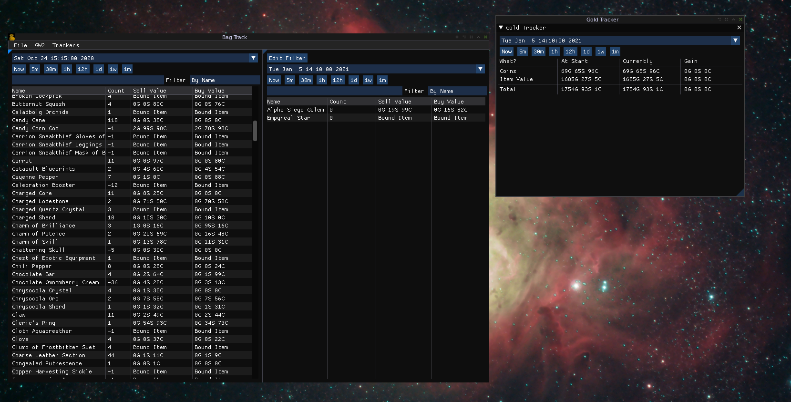
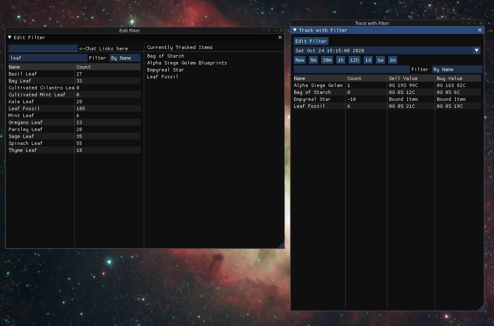
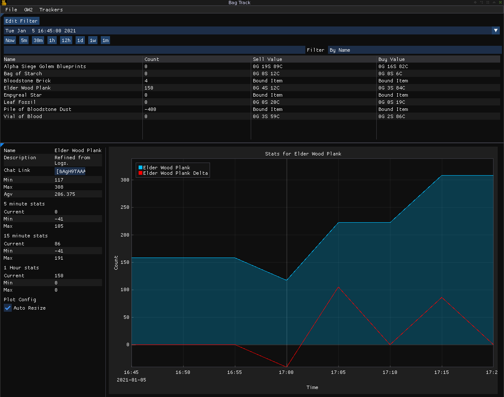

# Backtrack

Track inventory deltas, item information and more 

### Downloads are under releases!
[Latest Release](https://github.com/mkalte666/bagtrack/releases/latest)

If you are on linux, you have to compile it yourself. Windows has a normal download though!

### Item lists, Gold Tracker!

### Filtered Item Listings!

### Graphs!

### Works not only on Windows, but also on linux! 
I play on linux, so why wouldn't i write a tool that works on both? 

### Limitations 

 * There is no tracking when the app is not running
 * Api delay is around 5 minutes, so that is the limit on tracking interval. 
 * There is no guaranty of correctness for anything whatsoever. Take gold values with a grain of salt.
## Installation 

If you just want to use this (on windows) head to the [Latest Release](https://github.com/mkalte666/bagtrack/releases/latest) and grab the windows zip file. 
Extract it and run it from anywhere!

Linux instructions are below

## Building 

### Linux 
We have the following dependencies 

    SDL2 > 2.0.10
    SDL2_image 
    cmake
    git
    g++ or clang++
    python3
Everything else is in submodules. 

First get the sources. We have a lot of submodules in the tree, so we need to clone recursive. 

    git clone https://github.com/mkalte666/bagtrack --recursive 

Then we have a normal cmake workflow 
    
    cd bagtrack 
    mkdir build && cd build 
    cmake ../ -DCMAKE_BUILD_TYPE=Release 
    make -j 4 # adjust this number for your cpu. your pc might lag if you make it to large. 
    
You can also `sudo make install`, but you have to repeat it after each update of course.  

### For windows 
I use a cross compiler for windows binaries. This is handled by scripts under `windows/`. 
You should need nothing but a working git client, a working cross compiler (mingw-w64!) and a bit of patience.

## Need help? 
Contact me on reddit (u/mkalte666) or in game (mkalte666.4527) if you have any issues. 
You could also open an issue on github!